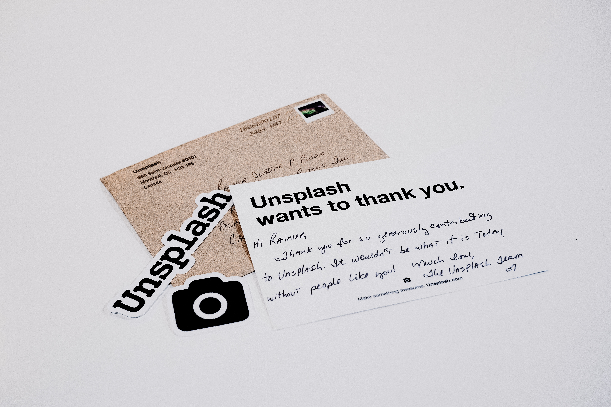

# Unsplash Shudder
>iOS Application for UNSPLASH API

[](https://swift.org)


Coding Challenge that recreates Shudder's featured page and fetches photos and collections using unsplash's API


>Photo by Rainier Ridao on Unsplash

## Requirements

- iOS 9.0+
- Xcode 9.4.1
- Moya
- Results
- Alamofire
- Kingfisher


## Installation

Run `git clone https://github.com/e-bushi/flickrShudder.git` to copy project locally

### Carthage

***Make sure you have carthage installed first***

Run `brew update` then `brew install carthage` 


***Downloads packages to root directory of project***

Run `carthage bootstrap --platform ios` to download packages necessary to run project.


***Another option is to create `Cartfile`  by running `touch Cartfile` in terminal and paste text below within the file***

```
github "Moya/Moya"
github "onevcat/Kingfisher" ~> 4.0
```

Follow the [instructions](https://github.com/Carthage/Carthage#if-youre-building-for-ios) to add `$(SRCROOT)/Carthage/Build/iOS/YourLibrary.framework` to an iOS project.

**The Results, and Alamofire Frameworks are packaged with Moya**

